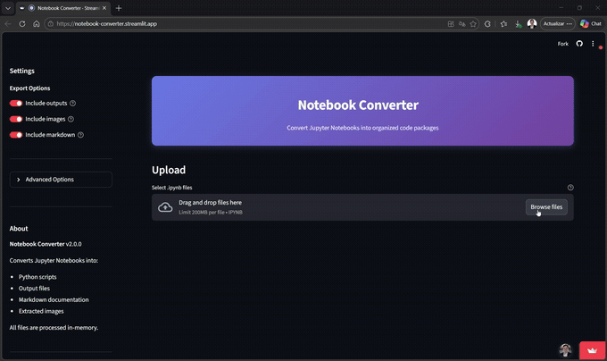

# Notebook Converter

[](https://www.python.org/downloads/)
[](https://streamlit.io/)
[](https://opensource.org/licenses/MIT)
[](https://github.com/JuanLara18/notebook-converter/actions/workflows/ci.yml)

Convert Jupyter Notebooks into organized, shareable Python packages — code, outputs, images, and full markdown documentation bundled in a single ZIP.

**Try the live app:** [notebook-converter.streamlit.app](https://notebook-converter.streamlit.app/)

<p align="center">
  
</p>

## Features

- **Batch processing** — convert multiple `.ipynb` files at once.
- **Code extraction** — clean Python scripts from code cells.
- **Output & image preservation** — cell outputs as text, images as PNG/JPEG/GIF.
- **Full documentation** — markdown that mirrors the notebook structure with code, outputs, and original markdown cells.
- **Configurable** — remove magic commands, add cell numbers, custom ZIP names, encoding selection.

## Quick Start

```bash
git clone https://github.com/JuanLara18/notebook-converter.git
cd notebook-converter
pip install -r requirements.txt
streamlit run app.py
```

## Documentation

Full guides are in the [`docs/`](docs/) folder:

| Guide | Description |
|-------|-------------|
| [Installation](docs/installation.md) | Prerequisites, pip/Poetry setup |
| [User Guide](docs/user-guide.md) | Usage workflow and configuration options |
| [Output Format](docs/output-format.md) | ZIP structure and documentation format |
| [Development](docs/development.md) | Architecture, tests, linting |

## Contributing

Contributions are welcome — see [CONTRIBUTING.md](CONTRIBUTING.md) for guidelines.

## License

MIT — see [LICENSE](LICENSE) for details.

## Author

Juan Lara — [GitHub](https://github.com/JuanLara18)
